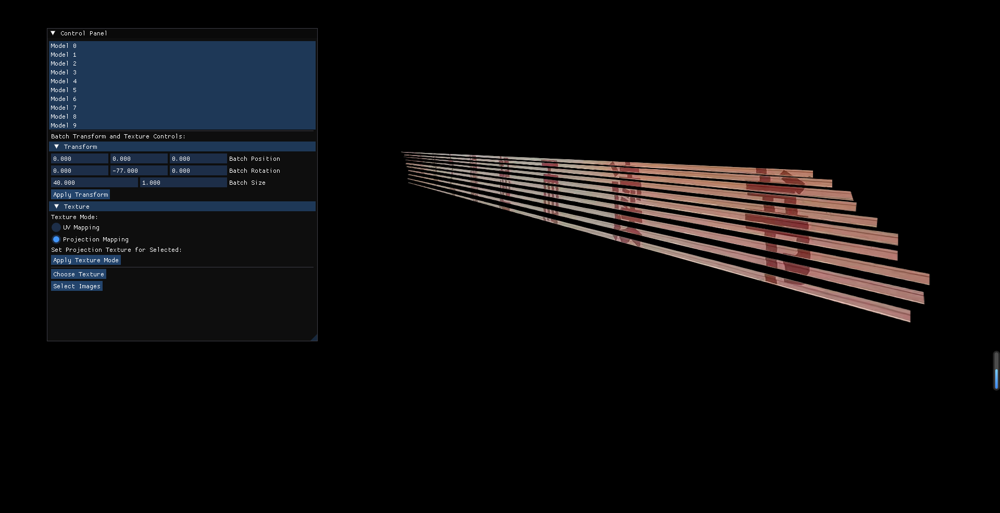

# texture_projection

本项目仿照“投影仪”工作原理，用于将二维图片投射到三维模型上（当前模型以三维平面为主，后续可能会进一步扩展功能）。

程序实现了一个简单的用户界面，允许用户输入多个图片路径并以此为纹理依次投影到多个平面上，主要用来恢复楼梯上被分割的破碎字形，便于字体辨认。

## 效果展示

本项目可以批量选择模型并进行基本转换，纹理可以选择基础uv映射和投影映射，摄像机方位可以移动（wasd和鼠标点击拖动操作）。

## 依赖

本项目依赖以下库：

- OpenGL：用于图形渲染
- GLFW：用于创建窗口和处理用户输入
- GLAD：用于加载 OpenGL 函数指针
- GLM: 提供向量和矩阵类型及操作
- ImGui：用于创建用户界面
- stb_image.h：用于加载图像文件
