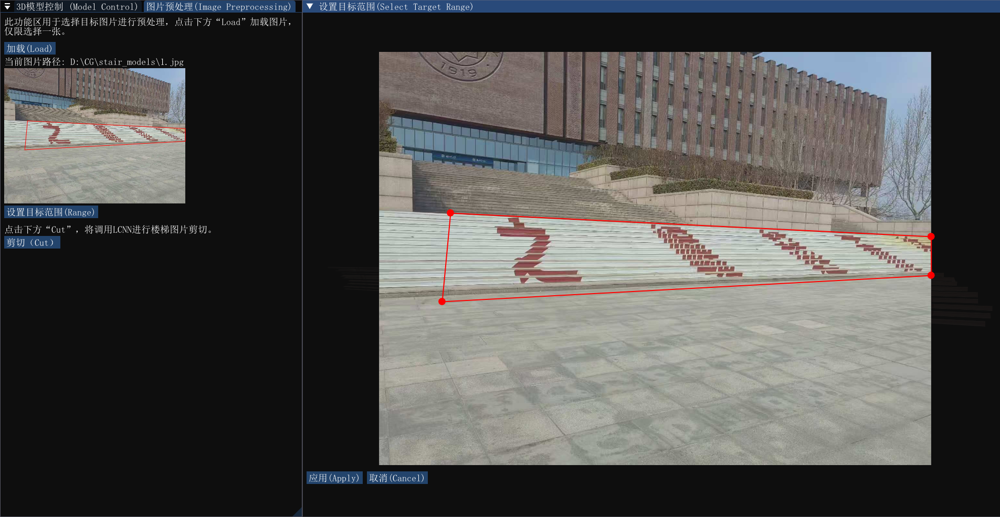
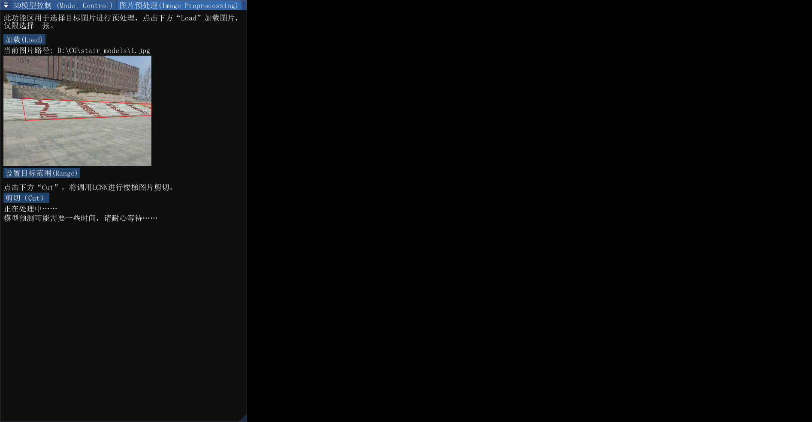
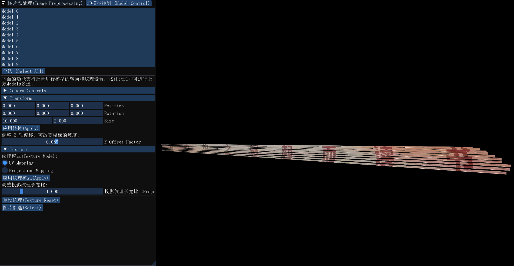
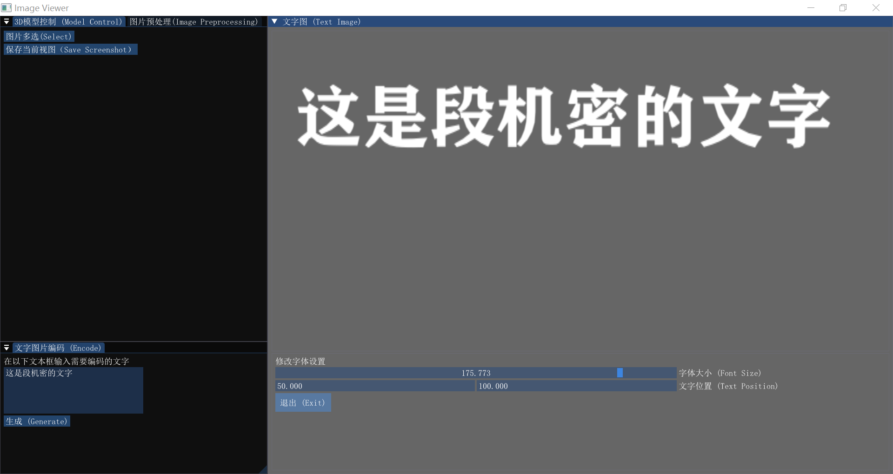
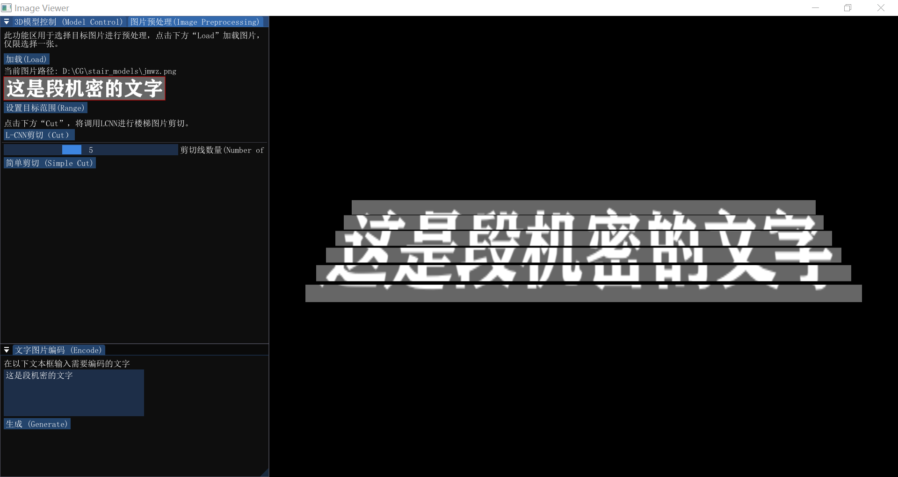
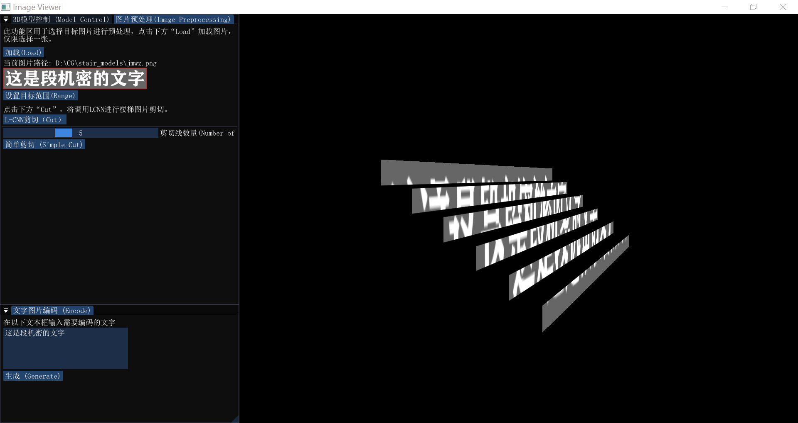

# Texture Projection

## 项目简介
本项目以纹理投影功能为基础，并且接入了LCNN（参考`https://github.com/zhou13/lcnn/tree/master`）进行预处理辅助，旨在通过该程序简化楼梯字体识别乃至实现自动化识别。

- 在预处理部分，LCNN起到主要作用。在LCNN原模型的基础上，我借助StairNet数据集对原模型进行了进一步训练，使得LCNN模型从宽泛的“线框检测”功能进阶为“楼梯线检测”功能，虽然不如SairNet的效果那么优秀，但足以完成预处理工作。
- 在纹理投影部分，以OpenGL为工具，仿照“投影仪”工作原理，用于将二维图片投射到三维模型上，并且支持用户手动调整模型、修正纹理、转换视角。

程序实现了一个简单的用户界面，分为工作区和视图区，主要用来恢复楼梯上被分割的破碎字形，便于字体辨认。程序允许用户输入单张照片进行“预处理+纹理投影”一体化自动执行；此外用户也可以选择自己输入多个图片路径，直接进行纹理投影。

项目的主要目的是用于处理含有楼梯的图形，所以建模部分统一采取建立平行平面的方式，每个平面对应一张图片作为纹理。

## 应用效果展示
项目主要用于带图片或楼梯的图像处理，目的在于使侧向楼梯上的图像或文字恢复到可辨认的状态，而非完全复原。建议输入图片保持相对竖直，与楼梯重心处于同一水平面效果最佳。

- 步骤一：框选感兴趣区域。点击`“加载(Load)”`载入图片，点击工作区的`“设置目标范围(Range)”`，拖动四角的红点框选楼梯字体或图片所在的方位，完成后点击`应用(Apply)`完成框选。

- 步骤二：进行预处理。点击左侧工作区的`“剪切(Cut)”`调用LCNN进行楼梯线检测，目前模型执行时间较长，工作区会显示“正在处理中……”提示，完成后提示消失，剪切结果以3D模型的形式展示在右侧视口。

- 步骤三：模型转换与视察。切换工作区到`“3D模型控制”`窗口，工作区窗口会展示所有显示的Model，并且按照自下而上的顺序排列，点击即可选中，可以通过`ctrl`进行多选，也可以点击`"全选"`同时选中。选中后可以进行模型基础转换和纹理更替（支持基础uv映射和投影映射）。操作鼠标（点击拖动改变相机角度和滚轮调整视口）和键盘（WASD调整相机左右和远近）可以更改相机位置。重新自己选择图片作为纹理也可，注意图片必须按照自下而上数字命名。

## 新扩展功能————编码解码
可以利用本项目进行文字图片的文字编码和解码工作，就像处理楼梯上的字一样。

## 依赖

本项目基于Windows平台，依赖以下库：

- OpenGL：用于图形渲染
- GLFW：用于创建窗口和处理用户输入
- GLAD：用于加载 OpenGL 函数指针
- GLM: 提供向量和矩阵类型及操作
- ImGui：用于创建用户界面
- stb_image.h：用于加载图像文件

## 注意事项

1. 导入的图片务必不能是中文路径，否则无法在ImGuiFileDialog打开的文件选择对话框找到
2. 调用L-CNN需要一些依赖的Python库，请在配置时注意
3. 在LCNN/demo.py中有两个绝对路径，注意修改为自己的路径
4. 本项目在Visual Studio上开发，路径处理依赖了Application/utils.cpp中的convertPath()函数，请根据自己的开发工具修改该函数
5. 项目中的checkpoint_best_2.pth没有放入仓库内，可以到 https://huggingface.co/spaces/FilotimoGao/3DStairProcess/blob/main/checkpoint/checkpoint_best_2.pth 进行下载
6. 当前版本的项目已经打包好，不想自己从头编译可以直接在 https://huggingface.co/spaces/FilotimoGao/3DStairProcess/tree/main/Release 下载msi和exe文件，一键安装，运行前同样需要注意第2点

## 待解决问题

1. 程序假如进行“剪切(Cut)”完成后，点击右上角的叉退出不能结束进程，需要强制退出
2. 对3D模型界面的相机控制可以进一步优化以提高用户的使用手感